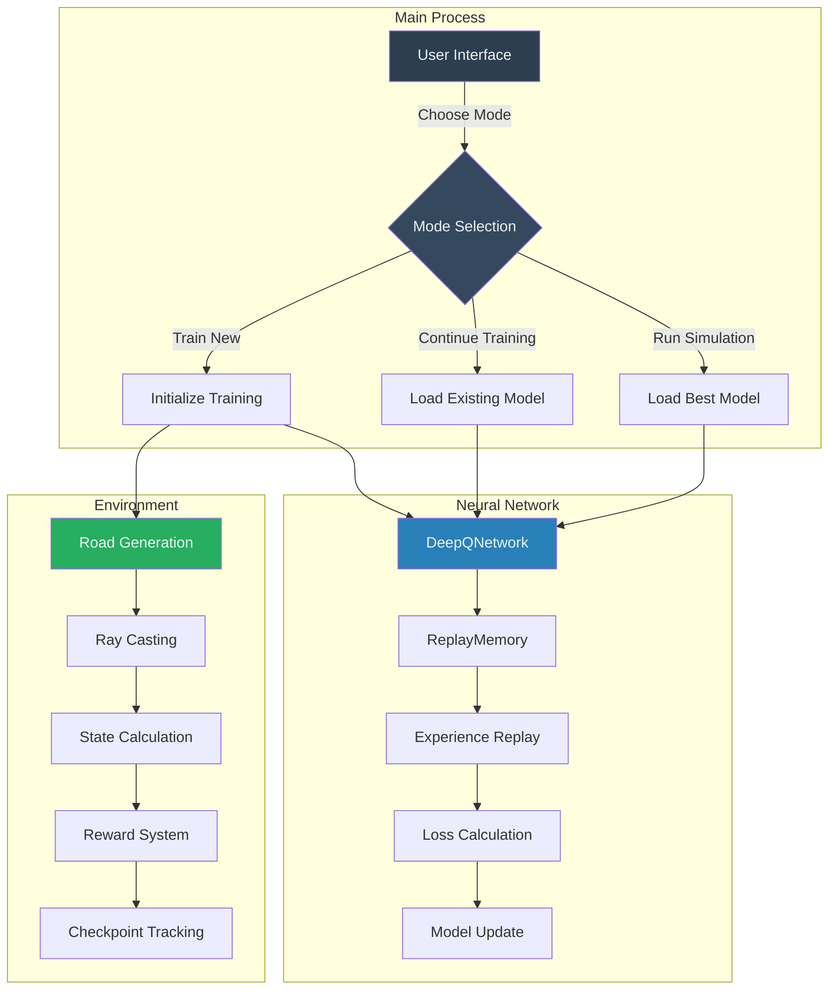

# Autonomous Vehicle Simulation: Deep Q-Learning

## Overview
A Pygame-based self-driving car simulation using Deep Q-Learning (DQN) to train an autonomous vehicle navigating procedurally generated roads.

## Technical Architecture


### Neural Network Design
- **Architecture**: 4-layer fully connected neural network
  - Input Layer: 9 neurons (8 ray distances + current speed)
  - Hidden Layers: 128 → 256 → 128 neurons
  - Output Layer: 5 action neurons
- **Activation**: ReLU
- **Optimization**: Adam optimizer (learning rate: 0.001)

### Procedural Road Generation Algorithm
#### Mathematical Foundation
- **Initial Shape**: Circular ring using polar coordinate equations
  - Center point: `(GAME_WIDTH/2, GAME_HEIGHT/2)`
  - Base radius: `350`
  - Road width: `100 units`

#### Noise-Driven Road Deformation
- **Technique**: Multi-layered Perlin noise
- **Noise Layers**:
  1. Primary noise: Large-scale terrain variation
  2. Secondary noise: Medium-scale terrain features
  3. Variation noise: Fine-scale terrain details
  4. Random bulge generation

### Reinforcement Learning Components
- **Algorithm**: Deep Q-Network (DQN)
- **Exploration Strategy**: ε-greedy with exponential decay
  - Start exploration rate: 0.9
  - End exploration rate: 0.05
  - Decay constant: 2000 steps

### Environment Mechanics
- **State Representation**
  - 8 ray-cast sensor distances
  - Current vehicle speed
- **Action Space**: 5 discrete actions
  - Accelerate
  - Decelerate
  - Turn left
  - Turn right
  - Idle

### Reward Mechanism
- **Reward Components**
  - Inside road: +1
  - Outside road: -100
  - Speed bonus: +0.1 * current_speed
  - Lap completion: +100

## Performance Optimization
- GPU acceleration support
- Experience replay buffer (50,000 transitions)
- Target network for stability
- Periodic network synchronization

## Requirements
- Python 3.8+
- Libraries:
  - pygame
  - numpy
  - torch
  - noise

## Installation
```bash
pip install pygame numpy torch noise
```

## Usage

```bash
git clone https://github.com/Abhigyan126/Track-DQN.git
python car.py
```

Run the script and choose a mode:
1. Train new model
2. Continue training existing model
3. Run trained model

## Model Persistence
- Saves model states during training
- Tracks best-performing model
- Supports training continuation
- Saved files:
  - `car_model.pth`: Latest model
  - `car_model_best.pth`: Best performing model
  - `car_model_final.pth`: Final training state

## Sensor System
- **Ray Casting**
  - 8 directional rays
  - Maximum ray length: 200 units
  - Collision detection with road boundaries

## Hyperparameters
- Discount factor (γ): 0.99
- Batch size: 128
- Target network update frequency: Every 10 episodes
- Maximum episode steps: 2000

## Technical Dependencies
- PyTorch for neural network
- Pygame for simulation
- NumPy for numerical computations
- Python-noise for terrain generation

# Autonomous Vehicle Simulation: Deep Q-Learning

## Procedural Road Generation Methodology

### Road Creation Algorithm
1. **Base Circular Foundation**
   - Start with a perfect circular ring using trigonometric functions
   - Use polar coordinate transformation: 
     ```
     x = center_x + (radius + noise) * cos(angle)
     y = center_y + (radius + noise) * sin(angle)
     ```

2. **Noise Injection Technique**
   - Employ Perlin noise for controlled randomness
   - Multiple noise layers:
     - Primary noise: Large terrain variations
     - Secondary noise: Medium-scale features
     - Variation noise: Fine-scale details

3. **Noise Generation Process**
   ```python
   def generate_road_points():
       base_radius = RADIUS * random.uniform(0.8, 1.2)
       for angle in range(POINTS):
           # Compute noise components
           primary_noise = pnoise1(angle * 0.1) * 60
           secondary_noise = pnoise1(angle * 0.2) * 30
           variation_noise = pnoise1(angle * 0.05) * 20
           
           # Combine noise layers
           combined_noise = (
               primary_noise + 
               secondary_noise * 0.5 + 
               variation_noise * 0.3
           )
           
           # Optional random road feature
           if random.random() < 0.1:
               combined_noise += random.uniform(-30, 30)
           
           # Compute final radius
           current_radius = max(base_radius + combined_noise, ROAD_WIDTH * 2)
   ```


